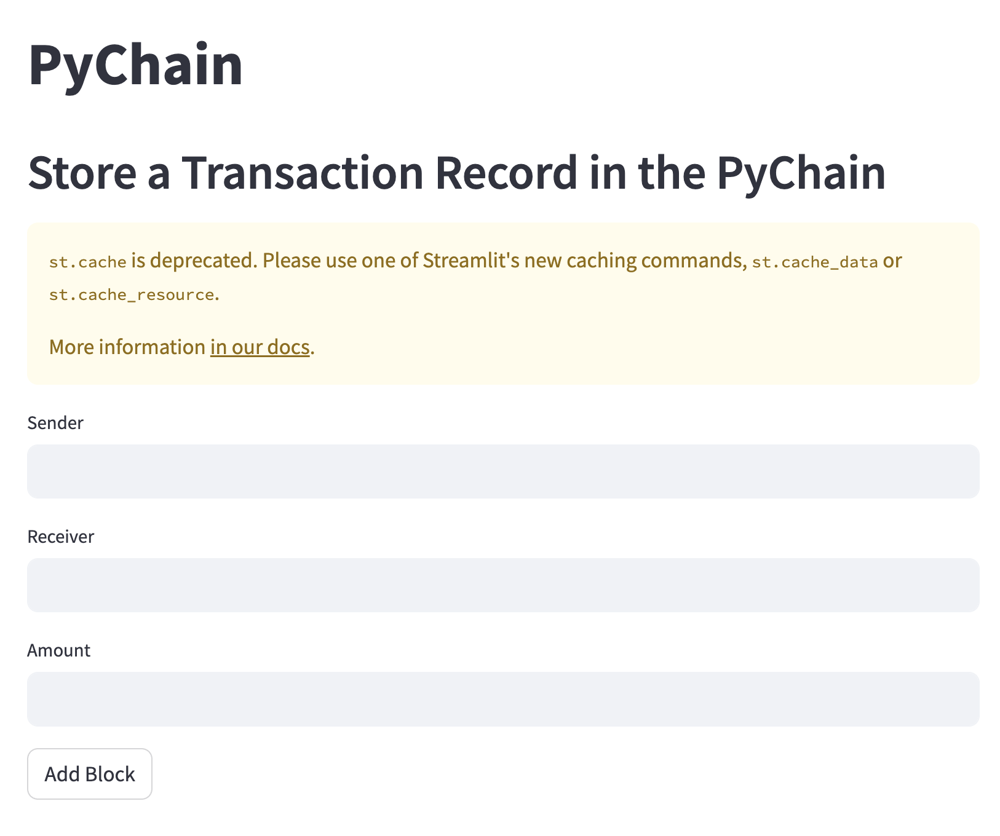
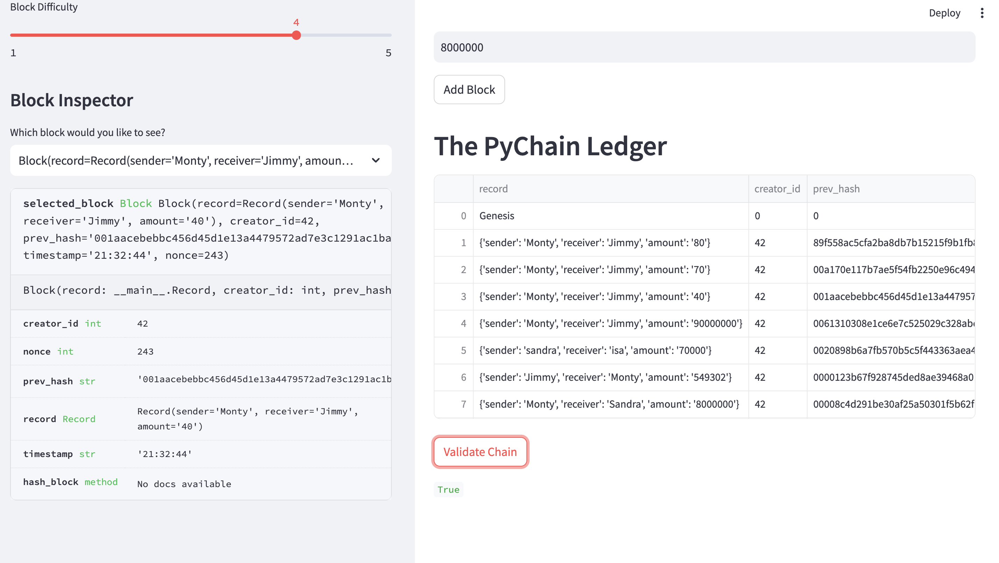

# PyChain Ledger
This is a Streamlit application that replicates the way a block chain is structured by creating a ledger that stores hypothetical monetary transactions.

The application takes in 3 inputs: string "sender", string "reciever", and float "amount".

Our application encrypts and stores the inputs into our blockchain as a new block. It uses Secure Hash Algorithm 256-bit (SHA-256) and proof of work as the consensus mechanism to validate each transaction.

Each newly created block contains the unique hash of the previous block, and that previous block's hash represents encrypted data for all of the blocks before it going back to the genisus of the chain. So, each step of the chain will introduce a new encryption. 