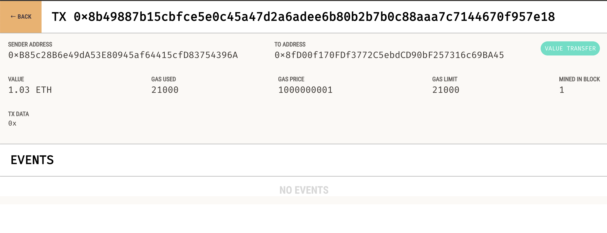

## Unit 19 Homework: Cryptocurrency Wallet

### Background

You work at a startup that is building a new and disruptive platform called KryptoJobs2Go. KryptoJobs2Go is an application that its customers can use to find fintech professionals from among a list of candidates, hire them, and pay them. As KryptoJobs2Go’s lead developer, you have been tasked with integrating the Ethereum blockchain network into the application in order to enable your customers to instantly pay the fintech professionals whom they hire with cryptocurrency.

In this Challenge, you will complete the code that enables your customers to send cryptocurrency payments to fintech professionals. To develop the code and test it out, you will assume the perspective of a KryptoJobs2Go customer who is using the application to find a fintech professional and pay them for their work.

### What You're Creating

To complete this Challenge, you will use two Python files, both of which are contained in the starter folder.

The first file that you will use is called `krypto_jobs.py`. It contains the code associated with the web interface of your application. The code included in this file is compatible with the Streamlit library. You will write all of your code for this Challenge in this file.

The second file that you will use is called `crypto_wallet.py`. This file contains the Ethereum transaction functions that you have created throughout this module’s lessons. By using import statements, you will integrate the `crypto_wallet.py` Python script into the KryptoJobs2Go interface program that is found in the `krypto_jobs.py` file.

Integrating these two files will allow you to automate the tasks associated with generating a digital wallet, accessing Ethereum account balances, and signing and sending transactions via a personal Ethereum blockchain called Ganache.

Specifically, you will assume the perspective of a KryptoJobs2Go customer in order to do the following:

* Generate a new Ethereum account instance by using the mnemonic seed phrase provided by Ganache.

* Fetch and display the account balance associated with your Ethereum account address.

* Calculate the total value of an Ethereum transaction, including the gas estimate, that pays a KryptoJobs2Go candidate for their work.

* Digitally sign a transaction that pays a KryptoJobs2Go candidate, and send this transaction to the Ganache blockchain.

* Review the transaction hash code associated with the validated blockchain transaction.

Once you receive the transaction’s hash code, you will navigate to the Transactions section of Ganache to review the blockchain transaction details. To confirm that you have successfully created the transaction, you will save screenshots to the README.md file of your GitHub repository for this Challenge assignment.

© 2021 Trilogy Education Services, a 2U, Inc. brand. All Rights Reserved.

